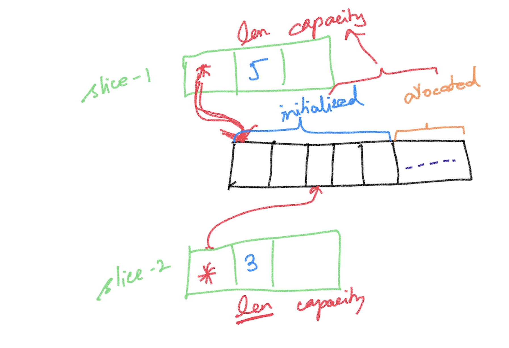

# Go Foundations #
- Magesh Kuppan

## Methodology ##
- No powerpoints
- We discuss & code
- Repo : https://github.com/tkmagesh/Cisco-Go-Aug-2023

## Schedule ##
- Commence      : 9:00 AM
- Tea Break     : 10:40 AM (20 mins)
- Lunch Break   : 12:30 PM (1 hour)
- Tea Break     : 2:30 PM (20 mins)
- Wind up       : 5:00 PM

## Golang ##
- Why Golang?
    - Simplicity
        - ONLY 25 keywords
        - No access modifiers (public, private, protected)
        - No classes (only structs)
        - No inheritance (only composition)
        - No reference type (everything is a value in go. Use pointers for references)
        - No exceptions (only errors which are just values)
        - No try-catch-finally constructs
        - No pointer arithmatic
        - No implicit type conversion (every type conversion has to be explicit)
        - No function overloading
        - No operator overloading
    - Performance
        - On par with C++
    - Close to hardware
    - Lightweight concurrency model

## Software Requirements ##
- Go Tools (https://go.dev/dl)
- Visual Studio Code (https://code.visualstudio.com)
- Go Extension for VSCode (https://marketplace.visualstudio.com/items?itemName=golang.Go)

## Introduction ##
- Documentation
    - https://pkg.go.dev/std
- Run a go program
    - > go run <filename.go>
- Create a build
    - > go build <filename.go>
    - > go build -o <output_file> <filename.go>

- To get the list of environment variables used by go tool
    - > go env
- Environment variables for cross compilation
    - GOARCH
    - GOOS
- To get the list of supported platforms/process arch for cross compilation
    - > go tool dist list
- To cross compile
    ```
     GOOS=<target OS> GOARCH=<target processor arch> go build -o <output> <filename.go>
    ```    
    - > ex: GOOS=windows GOARCH=386 go build -o build/hw 01-hello-world.go

## Data Types ##
- bool
- string

- int
- int8
- int16
- int32
- int64

- uint
- uint8
- uint16
- uint32
- uint64

- float32
- float64

- complex64 (real [float32] + imaginary [float32])
- complex128 (real [float64] + imaginary [float64])

- byte (alias for uint8)
- rune (alias for int32)(unicode code point)

## Variables ##
- Function Scope
    - Cannot have unused variables
    - Can use :=
- Package Scope
    - Can have unused variables
    - Cannot use :=

## Constructs ##
- if else
- switch case (with "fallthrough")
- for
- break & continue
- Labels & goto

## Functions ##
- Functions can return more than 1 result
- Variadic functions are supported (functions with varying number of arguments)
- Anonymous functions 
- Higher Order Functions (functions as data)
    - Assign functions as values to variables
    - Pass functions as arguments to other functions
    - Return functions as a return values from other functions

## Error Handling ##
- No exceptions, only errors
- errors are just values which are returned from a function
- Create an instance of an error
    - errors.New()
    - errors.Join()
    - fmt.Errorf()
- Check if an error is of particular type
    - errors.Is()

## Deferred Functions ##
- Postpone the execution of the function until the current function execution is completed

## Panic & Recovery ##
- Panic 
    - The state of the application where the application execution cannot proceed any further
- "recover()" can be used to gain access to the error that resulted in a panic
- "panic()" can be used to programmatically create a panic

## Pointers ##
- Everything is a value in Go
- Use pointers to send data around as references

## Collections ##
- Array
- Slice
- Map
### Array ###
- Fixed size typed collection
### Slice ###
- Varying sized typed collection
- Slice == Pointer to an underlying array
- Use the "append()" to add more data

### Map ###
- typed key/value pair collection
## Modularity ##
- Achieved using modules & packages
### Module ###
- Any code that has to be versioned & deployed together
- a module = a folder with go.mod file
- go.mod file
    - module name
        - convention (repo path)
    - targetted version of the go runtime
    - dependent modules (optional)
- created using "go mod init <module_name>"

- To run a module
    - > go run .
- To build a module
    - > go build .

### 3rd Party Modules ###
- download (GOPATH/pkg) and update the dependency 
    - > go get <module>
    - > ex: go get github.com/fatih/color
- update the mod file
    - > go mod tidy
- install 3rd party command line tools built in go (GOPATH/bin)
    - > go install <module>
- download the dependencies documented in the go.mod file
    - > go mod download
- to localize the dependencies
    - > go mod vendor
- Other useful commands
    - > go mod graph
    - > go mod why <module>
- Reference : https://go.dev/ref/mod


### Package ###
- Internal organization of code in a module
- typically a folder
- All the files in a package are considered to be one entity
- Everything in a package is by default considered private
- Public entities names must start with 'uppercase'

## OOP in Go ##
### Class (aka struct) ###

## Concurrent Programming ##
- Built in scheduler
- Concurrency features are built in the language
    - go keyword
    - channel data type
    - channel operator (<-)
    - range construct
    - select-case construct
- APIs support
    - sync package
    - sync/atomic package
- sync.WaitGroup
    - semaphore based counter
    - maintains an internal counter
    - has the ability to block the execution of the function until the counter becomes zero
